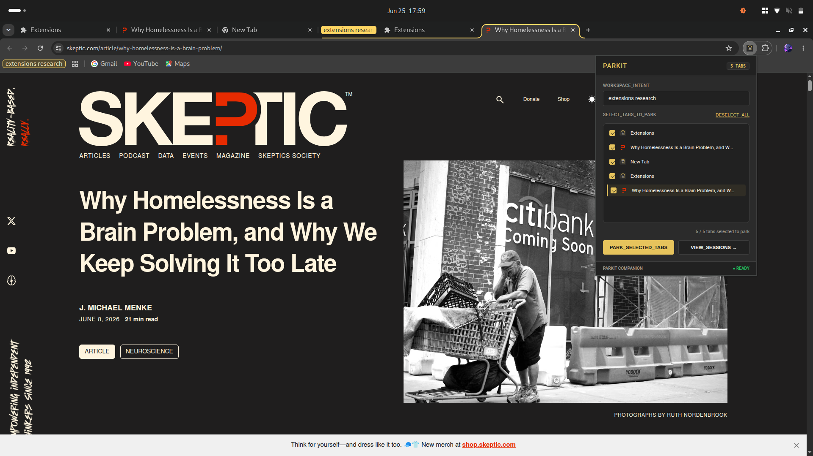

# Parkit

> Intent-driven tab manager. Park groups of active tabs with intent labels, not raw URL lists.

---

## What it does

Your browser is cluttered with 20 open tabs. You want to clear your workspace, but you don't want to lose your research context. Saving a bookmark folder is too permanent, and a reading list is just a messy dump.

Parkit lets you select exactly which tabs to park, type a quick intent label (like "Rust Concurrency" or "Flight Booking"), and closes them for you. Later, restore the entire session with one click as a new window or a neatly colored native Chrome Tab Group.

---

## Install

> Load manually in Developer Mode:

1. Download the extension source files
2. Go to `chrome://extensions` → enable **Developer Mode** (top right)
3. Click **Load unpacked** → select the `parkit` subdirectory containing `manifest.json`

Done. The icon appears in your toolbar.

---

## Features

- Select exactly which open tabs to park using an interactive checklist
- Auto-suggests intent labels dynamically based on the most frequent domain in your selected tabs
- Two-way session restores:
  - **WINDOW**: Restores all session tabs into a brand-new browser window to keep your current workspaces clean
  - **GROUP**: Bundles all session tabs directly into the current window as a native Chrome Tab Group, automatically named and colored
- Keyboard-first parking — submit your session instantly by pressing `Enter` within the intent label input field
- Zero-prompt deletions using an inline, two-step confirmation system (turns to "SURE?" and colors red, automatically resetting after 3 seconds of inactivity)
- Individual tab previews — expand any saved card to inspect links and click to open individual URLs
- Everything local — zero network requests, using `chrome.storage.local`

---

## Stack

`Vanilla JS` · `Manifest V3` · `Chrome Storage API` · `Chrome Tab Groups API` · `Chrome Tabs API`

---

## License

MIT
